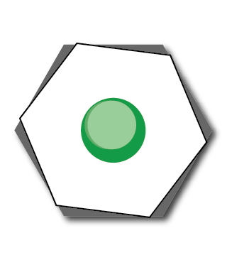

# p5.CollabHub

  
  
&lt--&gt

  

A p5 client library for collaborating with other performers on Collab-Hub.

CURRENTLY IN ALPHA - Full Collab-Hub functionality may not yet be implemented.  

Include the p5.CollabHub library in your p5 sketch using this script tag:  

      

p5.CollabHub requires [Socket.IO Client Installation](https://socket.io/docs/v4/client-installation/) (CDN recommended).  

Introduction and example sketches can be found in this [p5 collection](https://editor.p5js.org/ersheff/collections/-gBBpVYcp). 

More details coming soon...